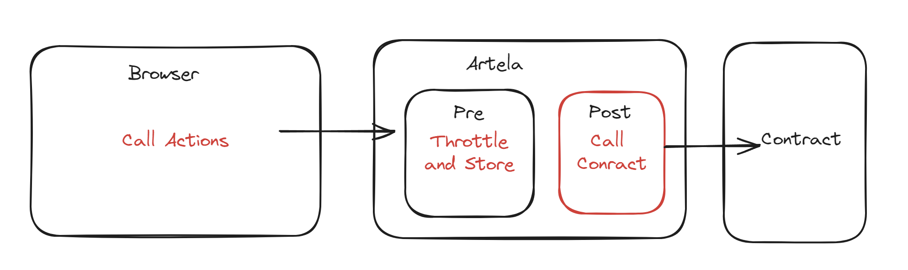

# Aspect-demo-with-Pet3
An Aspect demo show a Virtual Pet Game in browser

# Use Case Summary
A Virtual Pet Game in browser, with the following features:
- A pet can be created with a name and a type
- A pet can be fed, walked, and put to bed
- A pet can be played with, and it will get level up

Every action will counted and store in the Contract, and the pet's status will be updated in the browser.
This aspect demo has throttle and store the action counts , and then store the pet's status in the contract.

# Project Design

# Value to the Artela Ecosystem
- Data can cached in Artela rather than in the browser for better security
- Lower the cost of calling the contract by using the throttle

